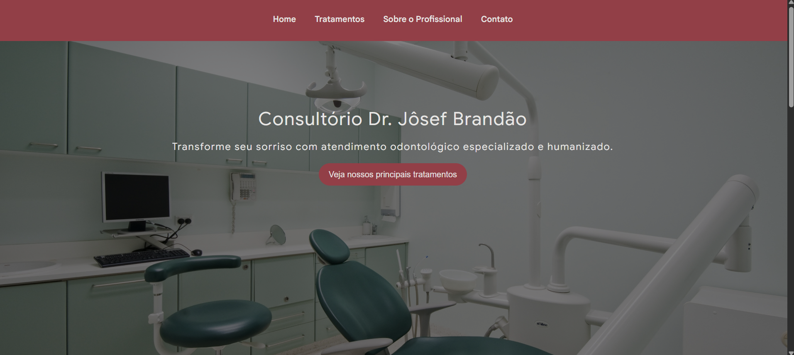

# Clínica Dr. Jôsef Brandão 

---

Landing Page desenvolvida como projeto prático para consolidar meus conhecimentos em HTML semântico e estilização básica com CSS.

O projeto foi criado com o intuito de apresentar os principais tratamentos ofertados pela clínica e possibilitar o contato direto para agendamento via 
WhatsApp de forma direta e intuitiva.

--- 

## Prévia do Projeto

---

## Tecnologias e Conceitos Utilizados

HTML5:
- Estruturação semântica completa.
- Navegação interna suave com links ancorados.
- Botão para contato direto e agendamento de consultas via WhatsApp.
- Ícone SVG inline integrado no rodapé.

CSS3:
- **Metodologia BEM (Block Element Modifier):** Nomenclatura organizada de classes.
- **Navegação Suave:** Implementação da propriedade `scroll-behavior: smooth`.
- **Animações & Interatividade:** Efeitos de `transition` e `hover` nos botões de chamada para ação (CTA).
- **Variáveis CSS (`:root`):** Centralização da paleta de cores para fácil manutenção.
- **Design Responsivo:** Media queries ajustando espaçamentos, tamanhos de fonte e alinhamentos para telas menores.

---

## Como Acessar

**[Clique aqui para ver a página rodando ao vivo](https://esdrasioseph.github.io/clinica-dr-josef/)**

---

## Autor

Desenvolvido por **Esdras Ioseph**  
Estudante de Análise e Desenvolvimento de Sistemas 
- GitHub: [@esdrasioseph](https://github.com/esdrasioseph)

